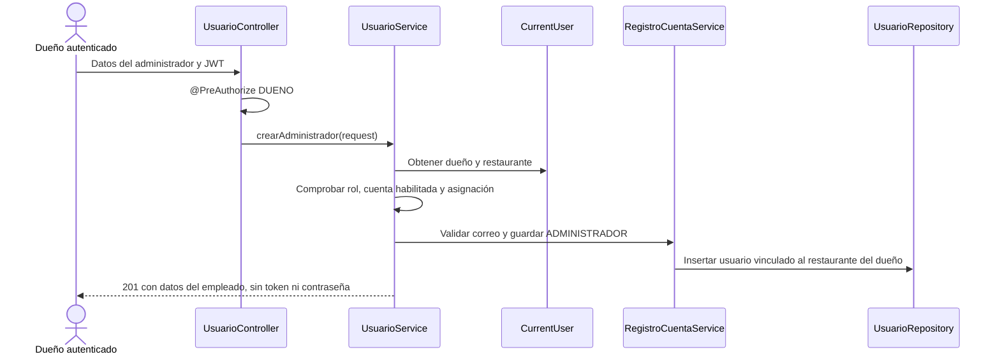

# US21 y US22 alta de dueños y administradores

Este incremento completa el alta de un restaurante por su dueño y la incorporación autorizada de administradores. Reutiliza Usuario, Rol y Restaurante. La cuenta CLIENTE continúa registrándose mediante POST /api/auth/register. No hay invitaciones por correo ni un flujo de aceptación del empleado: el dueño crea una cuenta con contraseña inicial y el administrador utiliza el login existente.

## US21 alta del dueño y restaurante

Endpoint público:

```http
POST /api/auth/register-owner
Content-Type: application/json
```

```json
{
  "nombreCompleto": "Ana Pérez",
  "correo": "ana@example.com",
  "password": "Password123!",
  "restaurante": {
    "nombre": "Restaurante Ana",
    "direccion": "Av. Principal 123",
    "telefono": "987654321",
    "horaApertura": "09:00",
    "horaCierre": "22:00",
    "tieneAtencionFisica": true,
    "aceptaDelivery": true
  }
}
```

El servidor responde 201 con id, correo, nombreCompleto, rol DUENO, restauranteId y token. El correo se almacena en minúsculas y la contraseña se guarda cifrada con BCrypt. Los identificadores los genera la base de datos; no se aceptan restauranteId, rol ni restaurante.id en la solicitud con valores no nulos.

Reglas:

- Cuenta y restaurante son una sola operación. Si falla el guardado de la cuenta o la generación del token, se revierte también el restaurante.
- El correo debe estar disponible. Un correo duplicado devuelve 409 y no cambia la cuenta existente.
- El restaurante debe tener nombre, dirección, teléfono, horas y configuración de atención. La apertura debe ser anterior al cierre; este incremento utiliza horarios dentro del mismo día.
- El rol DUENO y la activación inicial los asigna el servidor. El flujo crea un restaurante nuevo, no acredita propiedad de uno existente.
- Si una persona ya tiene una cuenta de cliente con ese correo, el alta se rechaza como duplicada; no cambia automáticamente su rol.

## US22 incorporación de administradores

Endpoint protegido:

```http
POST /api/usuarios/administradores
Authorization: Bearer TOKEN_DEL_DUENO
Content-Type: application/json
```

```json
{
  "nombreCompleto": "Luis Gómez",
  "correo": "luis@example.com",
  "password": "Password123!"
}
```

Respuesta 201:

```json
{
  "mensaje": "Administrador incorporado con éxito.",
  "id": 42,
  "nombreCompleto": "Luis Gómez",
  "correo": "luis@example.com",
  "rol": "ADMINISTRADOR",
  "restauranteId": 7
}
```

Los IDs del ejemplo son ilustrativos. No se devuelve token del empleado, contraseña ni hash. El dueño debe proporcionar al empleado sus credenciales iniciales por el medio acordado por el equipo; la aplicación no envía un correo ni obliga todavía a cambiar la contraseña en el primer acceso.

Reglas:

- Solo un dueño autenticado, habilitado y con restaurante asociado puede crear administradores. Clientes y administradores reciben 403.
- El restaurante se obtiene desde CurrentUser; no se recibe del formulario. Un restauranteId o rol no nulo enviado por el solicitante provoca 400.
- El correo es único entre todos los perfiles; un duplicado devuelve 409.
- El administrador inicia sesión en POST /api/auth/login con sus propias credenciales. La respuesta ahora también contiene restauranteId.
- Sus permisos de gestión se limitan a ese restaurante mediante los controles existentes de AccesoRestaurante.

## Componentes y razones de los cambios

| Componente | Responsabilidad y motivo |
|---|---|
| CuentaRequestDTO | Comparte validaciones de nombre, correo y contraseña para los dos nuevos flujos. |
| RestauranteAltaRequestDTO | Valida los datos del establecimiento nuevo y rechaza un ID existente. |
| RegisterOwnerRequestDTO | Compone cuenta y restaurante; reconoce y rechaza intentos de elegir rol o restauranteId. |
| CrearAdministradorRequestDTO | Datos del empleado; el solicitante no determina su rol ni restaurante. |
| OwnerRegistrationController | Expone POST /api/auth/register-owner, separado del registro de clientes. |
| AltaRestauranteService.registrar | Aplica horario y propiedad y coordina las escrituras con @Transactional. |
| RegistroCuentaService | Normaliza y comprueba correo, cifra contraseña y guarda el usuario. La base conserva su restricción única de correo para proteger inserciones simultáneas. Se utiliza dentro de la transacción de alta. |
| UsuarioController | Exige hasRole('DUENO') mediante @PreAuthorize. |
| UsuarioService.crearAdministrador | Vuelve a comprobar dueño habilitado y obtiene su restaurante, incluso si otro componente llama al servicio directamente. |
| AdministradorResponseDTO | Evita entregar datos de autenticación del empleado al crear su cuenta. |
| AuthResponseDTO / AuthService | Añaden restauranteId al registro y al login sin quitar los campos existentes. |
| GlobalExceptionHandler | Devuelve detalles de validación y 400 para JSON inválido; los conflictos de integridad se traducen a 409. |

```mermaid
sequenceDiagram
    actor D as Dueño nuevo
    participant C as OwnerRegistrationController
    participant A as AltaRestauranteService
    participant U as RegistroCuentaService
    participant DB as Repositorios y base de datos
    participant J as JwtService
    D->>C: Cuenta y datos de restaurante
    C->>A: registrar(request)
    A->>U: validarCorreoDisponible
    U->>DB: Comprobar correo
    A->>A: Validar horario y prohibir IDs previos
    A->>DB: Guardar restaurante
    A->>U: Crear usuario DUENO vinculado
    U->>DB: Guardar usuario con password cifrado
    A->>J: Generar token
    A-->>D: 201 con token y restauranteId
    Note over A,DB: Escrituras dentro de una misma transacción; un fallo revierte ambas
```



Para la sustentación: «La identidad del restaurante no se confía al formulario. En el alta del dueño la base genera un establecimiento nuevo; en el alta del empleado se toma el establecimiento del dueño autenticado. Así se evita que una persona reclame un negocio existente o asigne personal a otro restaurante».

## Pruebas y demostración

Ejecutar desde backend_RestoPilot:

```powershell
.\mvnw.cmd '-DforkCount=0' test
```

AltaPersonalIntegrationTest utiliza una base H2 temporal, MockMvc, seguridad real y contraseñas BCrypt. Las pruebas de reversión desactivan la transacción externa del test para comprobar la transacción real del servicio, no la reversión automática al terminar la prueba. Se simula un fallo después de persistir el restaurante y otro después de persistir también la cuenta.

Resultado verificado el 7 de octubre de 2026: **BUILD SUCCESS, 39 pruebas, 0 fallos y 0 errores**. Son 25 pruebas del incremento anterior y 14 pruebas nuevas de US21/US22. Se ejecutaron en H2; queda pendiente repetir la demostración en PostgreSQL. La colección nueva contiene 16 peticiones con comprobaciones de respuesta para ejecutar en Postman.

Importar postman/US21-US22-altas.postman_collection.json y ejecutar en orden. La colección crea dueños, restaurantes, un administrador y un cliente de demostración y comprueba los rechazos. Guarda los registros para inspección; se genera un correo distinto por ejecución. Usar una base de demostración y configurar baseUrl. No necesita las cuentas fijas de DataInitializer.

Este incremento no añade tablas ni columnas; reutiliza el esquema actual. La actualización SQL del commit anterior sigue siendo necesaria si esa corrección todavía no se ha aplicado a la base compartida. Las pruebas aquí descritas no ejecutan esa migración ni se conectan a PostgreSQL.

## Registro del segundo commit

Revisar git diff y confirmar por separado este incremento después de las pruebas. Mantener fuera .idea/compiler.xml. Mensaje propuesto:

```text
feat: implementa US21 alta de dueño y US22 incorporación de administradores
```

Los estados Done de estas tareas se refieren a su alcance backend. Los formularios y la historia completa de extremo a extremo requieren la interfaz correspondiente.
