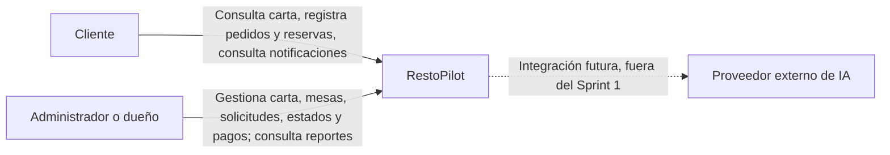
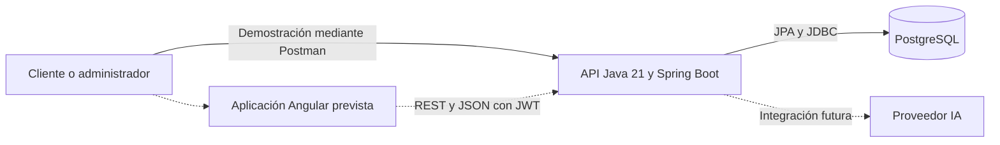
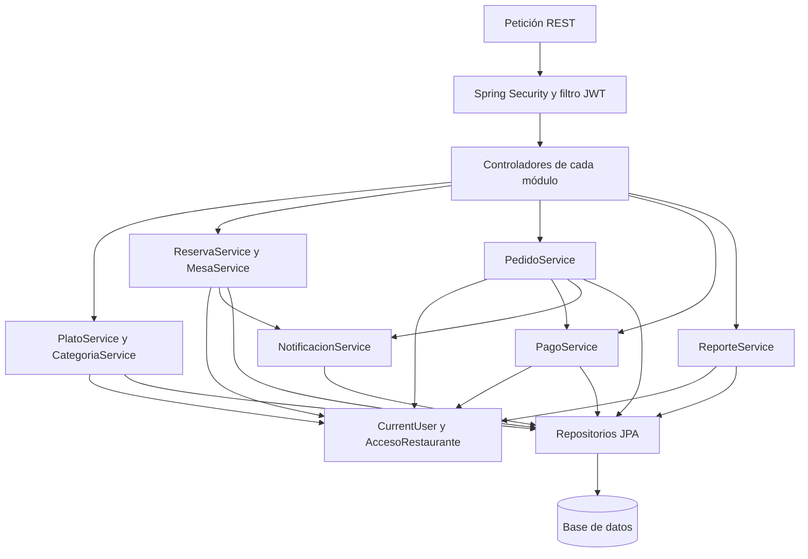
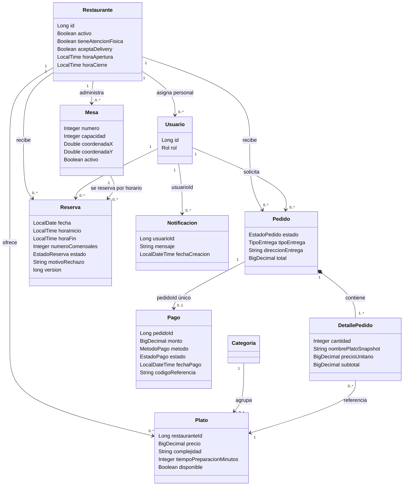
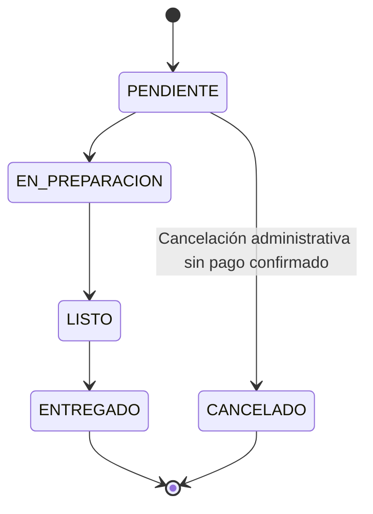
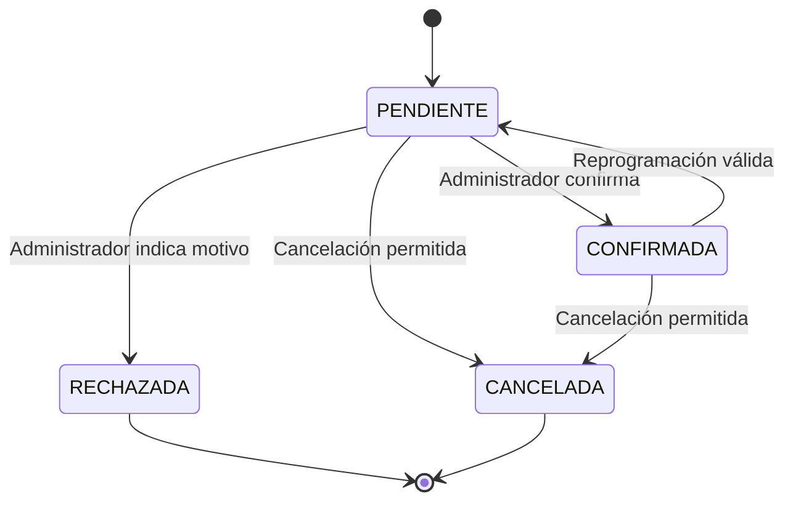

# RestoPilot reglas de negocio y sustentación de TB2

Esta guía explica el backend del Sprint 1 mediante sus reglas de negocio, los componentes que las ejecutan y los diagramas de arquitectura. La entrega comprende la API y su persistencia. La aplicación Angular, la integración de IA y una pasarela de pagos pertenecen a trabajo posterior. US18 conserva el registro administrativo de pagos.

## Cómo explicar una regla

Utiliza este orden: necesidad del restaurante → regla → ejemplo válido e inválido → clases que intervienen → evidencia de prueba. Un endpoint es una puerta de entrada; la regla está en el servicio. Una entidad representa información del negocio y el repositorio consulta o guarda esa información.

Ejemplo oral: «Una mesa no puede recibir dos reservas activas que se solapen. ReservaController recibe fecha y horario; ReservaService comprueba la disponibilidad; MesaRepository bloquea la mesa durante la transacción y ReservaRepository consulta los solapamientos. Solo PENDIENTE y CONFIRMADA bloquean disponibilidad. Si ya existe una reserva, el servicio rechaza la segunda. La prueba disponibilidadFiltraCapacidadYDetectaSolapamientos comprueba este comportamiento».

Las rutas de código indicadas abajo parten de `src/main/java/com/restopilot/backend/`.

## Contexto C4

Este nivel responde quién utiliza RestoPilot y para qué. No se explican todavía controladores, tablas ni clases.



Explicación: «El cliente solicita servicios al restaurante y el administrador gestiona su atención. RestoPilot centraliza esas operaciones. En TB2 implementamos el backend; el proveedor de IA representa una integración planificada. El pago de US18 se registra administrativamente después de recibirse por un medio externo; no afirmamos que se cobre mediante una pasarela».

## Contenedores C4

Un contenedor es una unidad de ejecución o almacenamiento. No significa necesariamente un contenedor Docker.



Explicación: «La aplicación web consumirá la API. Actualmente podemos ejecutar y demostrar la API con Postman. Spring Boot valida las operaciones, Spring Security controla el acceso y PostgreSQL conserva los registros. Para las pruebas automatizadas empleamos H2 temporal en modo PostgreSQL, por lo que esas pruebas no modifican la base configurada en `.env`».

No presentes H2 como base del producto. Tampoco presentes Angular o Spring AI como funcionalidades ya entregadas por este repositorio.

## Componentes C4 del backend



Explicación: «La seguridad identifica al usuario y permite entrar según su rol. El controlador traduce HTTP a una llamada al servicio. El servicio aplica las reglas y usa repositorios. CurrentUser obtiene al usuario autenticado; AccesoRestaurante comprueba que un administrador actúe sobre su restaurante. Las notificaciones se guardan dentro de la misma transacción que cambia el estado».

El backend es un monolito organizado por funcionalidades. Los módulos no son microservicios ni se despliegan individualmente.

## Clases del dominio

Este diagrama resume las entidades persistidas, no todos sus atributos ni todos los DTO. La asociación de Pago con Pedido y la de Notificacion con Usuario se almacenan mediante identificadores; no son relaciones JPA `@OneToOne` y `@ManyToOne` en esas clases.



Los pedidos nuevos generan un pago PENDIENTE en la misma transacción; la cardinalidad opcional contempla registros históricos que todavía no tengan pago. La composición Pedido–DetallePedido está implementada con `cascade = ALL` y `orphanRemoval = true`. Reserva y Pedido son operaciones independientes: una reserva no crea automáticamente un pedido.

## Reglas y componentes que debes señalar

| Regla | Código principal | Ejemplo y evidencia |
|---|---|---|
| El registro público crea clientes, no administradores | `modules/auth/service/AuthService.register` | Enviar rol ADMINISTRADOR devuelve 403; prueba HTTP de autorregistro. |
| Un administrador gestiona solamente su restaurante | `security/AccesoRestaurante.exigirGestion`, anotaciones `@PreAuthorize` | Otro administrador no puede cambiar el estado de nuestro pedido ni procesar nuestra reserva. |
| La carta se filtra por restaurante y categoría | `PlatoController.listar`, `PlatoService.listar`, `PlatoRepository.findByRestauranteIdAndCategoriaId` | Una categoría sin platos devuelve lista vacía. El frontend futuro mostrará el mensaje correspondiente. |
| Complejidad permitida BAJA, MEDIA o ALTA; preparación entre 5 y 15 minutos | `PlatoService.validarDatos` | Se rechazan 16 minutos y complejidad desconocida. |
| La categoría y el plato pertenecen al mismo restaurante | `PlatoService.validarCategoria` | No se puede asociar una categoría de otro local. |
| Un pedido exige restaurante activo y abierto, productos disponibles y cantidades positivas | `PedidoService.crearPedido`, `actualizarDetalles` | Restaurante cerrado, lista vacía o plato agotado impiden registrar el pedido. |
| Los platos del pedido pertenecen al restaurante elegido | `PedidoService.actualizarDetalles` | No se puede pedir en restaurante A un plato de B. |
| Delivery exige habilitación y dirección; salón exige atención física y mesa del local | `PedidoService.aplicarModalidad`, `Pedido`, `MesaRepository` | La dirección se guarda y sale en la respuesta; la mesa se valida cuando la modalidad es SALON. |
| El importe lo calcula el servidor y conserva el precio de compra | `DetallePedido.precioUnitario`, `PedidoService.actualizarDetalles`, `PedidoMapper` | Dos platos de S/20 totalizan S/40. Cambiar la carta a S/99 no altera el detalle histórico. |
| El cliente consulta únicamente sus pedidos y pagos | `PedidoService.getById`, `PagoService.obtenerPagoPorPedido` | Un pedido ajeno devuelve “Pedido no encontrado”. |
| La preparación sigue una secuencia | `PedidoService.actualizarEstado`, `EstadoPedido` | PENDIENTE → EN_PREPARACION → LISTO → ENTREGADO. Saltar a ENTREGADO se rechaza. |
| La cocina prioriza por complejidad, tiempo y antigüedad | `PedidoService.getPendientesCocina`, `calcularComplejidadMaxima`, `calcularTiempoMaximoPreparacion` | ALTA/5 min precede a MEDIA/15 min; entre dos ALTA se atiende primero la de más duración; ante empate, la más antigua. Se compara el máximo entre los platos del pedido. |
| Un pago confirmado es inamovible y debe coincidir con el total | `PagoService.registrarPago`, `PedidoRepository.findByIdForUpdate`, `Pago.pedidoId` único | Importe incorrecto se rechaza; segundo registro PAGADO devuelve 409. |
| Un pago electrónico confirmado necesita referencia | `PagoService.registrarPago`, `PagoRequestDTO` | YAPE, PLIN y TARJETA requieren referencia; EFECTIVO no. Es registro administrativo, no confirmación de una pasarela. |
| Un pedido pagado no puede cambiar su importe ni cancelarse mediante el endpoint administrativo | `PedidoService.actualizarPedido`, `eliminarPedido`, `PagoService.estaPagado` | Se conserva el historial y el pago; no se elimina físicamente el pedido. |
| Disponibilidad considera horario, capacidad y reservas activas | `ReservaService.consultarDisponibilidad`, `ReservaRepository.findMesaIdsConReservasSolapadas` | Mesas de cuatro personas no se ofrecen para cinco. La respuesta conserva coordenadas y el indicador disponible para el plano futuro. |
| No se admiten reservas activas solapadas en una mesa | `ReservaService.registrarReserva`, `MesaRepository.findByIdForUpdate`, `ReservaRepository.existsReservaSolapada` | A < D y B > C. Una reserva 15:00–16:00 bloquea 15:30–16:30, pero permite otra desde las 16:00. |
| Solo solicitudes pendientes pueden confirmarse o rechazarse | `ReservaService.procesarReserva`, `ProcesarReservaRequestDTO`, `EstadoReserva` | Confirmar dos veces se rechaza. El rechazo requiere motivo y libera la mesa. |
| Reprogramar una reserva requiere validaciones y una nueva evaluación | `ReservaService.modificarReserva` | Se comprueba disponibilidad y se vuelve a PENDIENTE. CANCELADA, RECHAZADA y COMPLETADA no pueden modificarse. |
| El cliente cancela con más de dos horas de anticipación | `ReservaService.cancelarReserva`, `TimeConfig` | A las 12:00 una reserva de las 14:00 no se cancela; una de las 15:00 sí. El límite exacto de dos horas se bloquea, conforme a “mayor a 2 horas”. |
| Cada decisión administrativa deja una notificación consultable por su destinatario | `NotificacionService.enviar`, `NotificacionController.consultar` | Confirmación, rechazo y cambios de estado crean mensajes en `/api/notificaciones/me`; no se envía email o SMS. |
| Los reportes usan datos del restaurante y un rango válido | `ReporteService.generarReporte`, `ReporteRepository` | Rango invertido se rechaza; período sin registros informa que no hay datos; otro restaurante no ve nuestros indicadores. |

## Estados para explicar en la pizarra





COMPLETADA existe en el modelo de reservas para registrar atención finalizada, pero el endpoint nuevo de procesamiento administrativo permite solo CONFIRMADA o RECHAZADA. No afirmes que este endpoint completa una reserva.

## Fórmulas de los reportes

Los filtros incluyen todo el día final: fechaCreacion >= inicio a las 00:00 y fechaCreacion < día posterior al fin a las 00:00. Reservas se filtran por fecha de la cita. Pagos se agrupan por la fecha de creación del pedido asociado, no por su fecha de cobro.

| Indicador | Definición implementada |
|---|---|
| Platos más vendidos | Suma de cantidades en pedidos ENTREGADO, agrupada por nombre histórico, en orden descendente. |
| Demanda por hora | Cantidad de pedidos no cancelados creados en cada franja horaria. |
| Volumen de atenciones | Pedidos ENTREGADO más reservas COMPLETADA. Cuenta operaciones, no personas únicas; pedido y reserva son independientes. |
| Ocupación reservada | Minutos reservados de mesas activas, con reservas CONFIRMADA o COMPLETADA, divididos entre mesas activas × minutos diarios de apertura × días del período. Se limita cada reserva al horario del local. |
| Monto cobrado | Suma de montos de pagos PAGADO de pedidos no cancelados del período. |
| Pendientes | Cantidad de pedidos no cancelados menos pedidos con pago confirmado; incluye pedidos históricos sin registro de pago. |
| Métodos de pago | Cantidad de pagos confirmados por método. |

Ejemplo de ocupación: una mesa, doce horas de apertura y una reserva confirmada de una hora equivalen a 60 / 720 × 100 = 8,33 %. Esta métrica utiliza la configuración actual de mesas y horario; no reconstruye cambios históricos ni prueba presencia física.

Consultas específicas: `/api/reportes/operativos?fechaInicio=AAAA-MM-DD&fechaFin=AAAA-MM-DD&tipo=PLATOS`. Los tipos admitidos son CONSOLIDADO, PLATOS, DEMANDA, ATENCIONES, OCUPACION y PAGOS. `/api/reportes/pagos` se conserva.

## Pruebas y criterios para Done

Ejecuta desde `backend_RestoPilot`:

```powershell
.\mvnw.cmd '-DforkCount=0' test
```

`PedidoServiceTest` comprueba reglas de servicio con repositorios simulados. `ReglasNegocioIntegrationTest` levanta Spring Boot con H2 en memoria, repositorios reales y MockMvc, y comprueba persistencia, JPQL, JWT, permisos, notificaciones y escenarios de rechazo. El reloj fijo permite repetir las pruebas de horarios sin depender de la hora de ejecución. Las pruebas no se conectan a PostgreSQL ni sustituyen una ejecución final sobre la base de demostración.

Para registrar una tarea como Done: código completo para el alcance backend → prueba aprobada → evidencia guardada → commit real cuando el equipo lo cree. Las interfaces y sus mensajes visuales siguen fuera de este sprint. No cambies automáticamente el estado de la historia completa a Done por completar un endpoint.

## Guion de demostración

1. Explica contexto y contenedores en un minuto: actores, API y PostgreSQL; aclara qué está implementado en TB2.
2. Muestra el diagrama de componentes y sigue una petición desde controlador hasta servicio y repositorio.
3. Consulta la carta filtrada. Explica cómo restauranteId y categoriaId limitan la consulta.
4. Registra un pedido con dos unidades; muestra total, dirección, precio histórico y pago pendiente.
5. Intenta consultarlo con otra cuenta. Explica JWT, rol y propiedad del registro.
6. Intenta saltar de PENDIENTE a ENTREGADO; luego ejecuta la secuencia válida y consulta las notificaciones.
7. Registra un pago de importe incorrecto, luego uno correcto e intenta modificarlo. Explica inmutabilidad.
8. Solicita una reserva, confirma o rechaza y demuestra que no puede procesarse dos veces. Muestra disponibilidad antes y después del rechazo.
9. Demuestra la cancelación con el límite de dos horas usando las pruebas de reloj fijo.
10. Consulta el reporte consolidado y un período sin datos. Explica una fórmula, en vez de limitarte a leer el JSON.
11. Enseña el resultado de las pruebas y relaciónalo con las tareas del sprint.

En cada demostración señala la clase del dominio en el diagrama de clases: Pedido para estados, DetallePedido para precio histórico, Pago para confirmación y Reserva–Mesa para disponibilidad. Después abre el método del servicio que hace cumplir la regla.

## Ajustes que necesitan los diagramas del informe

Compara con los diagramas incluidos en la versión final del informe. En la imagen local `diagrama_clases.png` se observan diferencias que debes revisar:

- EstadoPedido utiliza PENDIENTE en el código; la imagen dice REGISTRADO.
- TipoEntrega en el código contiene SALON, LLEVAR, RECOGER y DELIVERY; la imagen utiliza PARA_LLEVAR y DELIVERY.
- EstadoPago implementa PENDIENTE y PAGADO; FALLIDO pertenece a un posible flujo de pasarela y no está implementado.
- Reserva utiliza horaInicio y horaFin, numeroComensales, motivoRechazo y control de versión; la imagen muestra una sola hora.
- Mesa utiliza numero y coordenadas Double; el dibujo utiliza codigo y posiciones Integer.
- Añade precioUnitario histórico, direccionEntrega y el componente de notificaciones a los diagramas pertinentes.
- Los métodos de autenticación y las reglas de operación se ejecutan en servicios, aunque el modelo conceptual los ubique dentro de las entidades. Aclara la diferencia entre modelo del dominio y clases de implementación.
- La ventana limiteCancelacion se conserva para una futura cancelación mediante IA; no representa una funcionalidad de IA entregada en TB2.

No necesitas mostrar todas las clases a la vez. Elige una operación y explica cómo sus relaciones y sus reglas evitan un error concreto del restaurante.

## Preguntas para practicar

1. ¿Por qué comprobar el rol no basta? Porque también hay que comprobar propiedad o restaurante del recurso.
2. ¿Por qué el precio está en DetallePedido? Porque la carta cambia y el pedido debe conservar el precio acordado.
3. ¿Por qué un rechazo libera disponibilidad? Porque RECHAZADA no es un estado bloqueante.
4. ¿Qué evita dos reservas simultáneas? La transacción bloquea la mesa antes de comprobar y registrar el intervalo; la siguiente solicitud consulta los datos ya confirmados.
5. ¿Qué protege el pago? Un único registro por pedido, bloqueo del pedido durante la confirmación y prohibición de editar después de PAGADO.
6. ¿Qué significa SaaS en esta implementación? Varios restaurantes comparten API y base; las operaciones se restringen por restaurante y sus banderas habilitan módulos.
7. ¿Se procesan cobros? No. US18 registra administrativamente pagos recibidos. Una pasarela está fuera del alcance acordado.
8. ¿Qué falta para demostrar el producto completo? La interfaz, las integraciones posteriores y la verificación en el entorno de despliegue; el Sprint 1 se evalúa por sus tareas backend.
